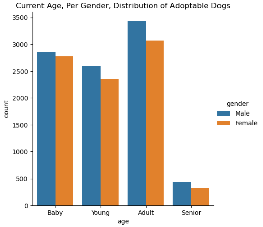

# Tutorial for PetAnalysis

## Introduction

This Python-package `petanalysis` contains 11 wrapper functions to get pet available data of the US. These functions process API [https://api.petfinder.com/v2/organizations?page=1](https://api.petfinder.com/v2/organizations?page=1e) to get data from shelter information and process API [https://api.petfinder.com/v2/animals?page=1](https://api.petfinder.com/v2/animals?page=1) to get the animal data. One function provide information for shelters and others provide information about animals. This package contains 8 internal functions, 2 for requesting API, 2 for data wrangling for shelter data, and 2 for data wrangling of animal data for association rules, and 2 for building plots which are not available to user. The list of 3 wrapper functions available to user is given below:

1. get_shelter(postcode = None): help the user to narrow down the region
2. assoc_rules(pets_data_df, min_supp, min_conf, sort_by_col, rule_cnt): provide initial analysis for user
3. visualize(): present data in charts

## Install Package

```
pip install petanalysis
```
Alternatively, user can install the package from github using command `install_github('atevhs/DATA534_PetAnalysis')

## Import Modules From Package

```
from petanalysis.location import *
from petanalysis.assoc_rules import *
from petanalysis.petplot import *
```

## Display How the Function Works

### 1. get_shelter
This function `get_shelter` returns a dataframe of shelter information of desired district of the US. The function accepts the postcode from the user. If user does not pass any argument then it would prompt a box for user to pass the postcode. The postcode for the US is five digit number, the function would validate the passed input. The returned data is a data frame and contains the columns including the id, name, phone, website and the postcode. The function can be called as below. 

```
get_shelter()
```

### 2. assoc_rules
This function `assoc_rules` returns a dataframe of association analysis result. The function accepts 5 arguments from the user to activate the function in mlxtend package. The function can be called as below.

```
assoc_rules()
```

### 3. visualize()

This function `visualize()` returns a age histogram  or a size heatmap. The function would prompt the user a box to pass their choice. The return age histogram would show the frequency of four age groups; and the size heatmap would show the information for age and size groups of our data. The function can be called as below. 

```
visualize()
```

If you choose option 1 you should now see a visualization like this:  


### Note: This package comes with a dataset that was collected using the api listed above. For a refreshed dataset the user will need to get an api key usig the link below and follow the steps given to download the data. Scripts on how to collect multiple pages at a time can be viewed in the 'API data extraction.ipynb' notebook located in the github repo.


```python

```
